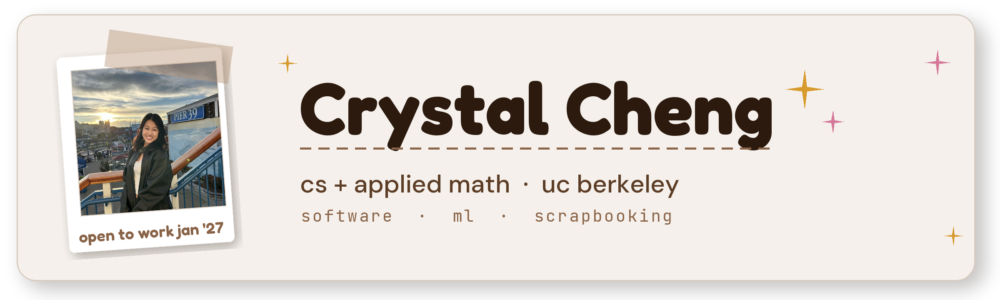

<p align="center">
  
</p>

# ⋆˚✩ cream-portfolio ✩˚⋆

my personal site, made to look like one of my scrapbook pages. i'm crystal, a cs and applied math student at uc berkeley, and i'm a little too into scrapbooking, so instead of reaching for a template i built my portfolio out of tape, polaroids, and pretty css. it's one long page: my software and ml work, the organizations i help run, and what i'm up to in my free time.

⟡ live: [chengjcrystal.vercel.app](https://chengjcrystal.vercel.app)

˗ˏˋ ꒰ ♡ ꒱ ˎˊ˗

## ✩ stack

- next.js (app router) + react
- typescript
- plain css, no ui framework, with custom fonts via `next/font`
- tabler + devicon icon fonts

## ✎ run locally

```bash
npm install
npm run dev
```

then open http://localhost:3000.

## ⟡ structure

- `src/app/page.tsx`: the whole page (about, experience, projects, skills, leadership, contact)
- `src/app/globals.css`: all the styling
- `src/components/`: hero, nav, footer, and the interactive bits (the photo doodle, the freshcheck demo modal)
- `public/`: images, logos, resume
